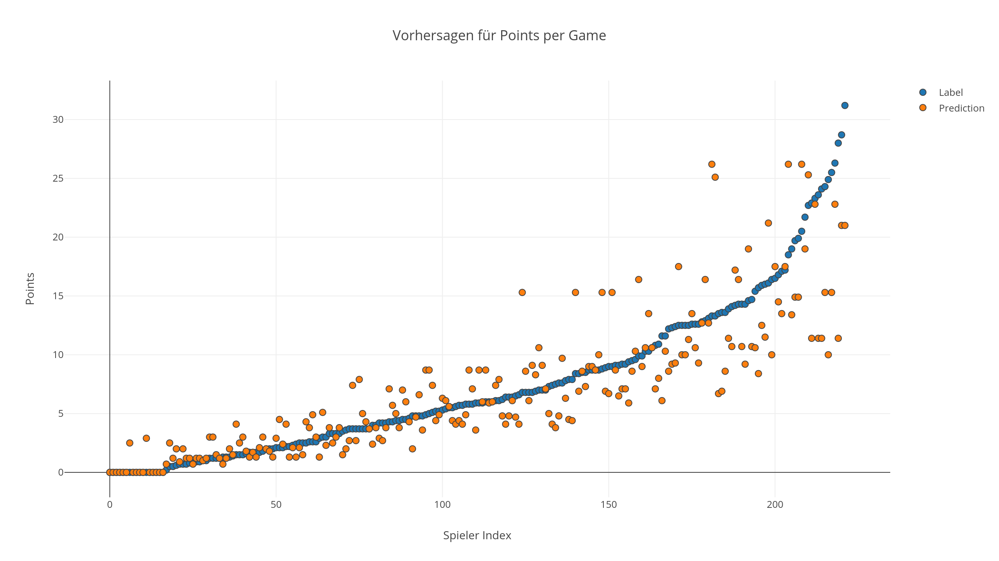

# Decision Tree

## NBA Statistics Data

**Data Source**: API: https://api.mysportsfeeds.co

**Objective**: Predicting points per game for NBA players

**Algorihtms**: 
* spark.ml.regression.DecisionTreeRegressionModel
* spark.mllib.tree.DecisionTree

**Label**: Points per game (pointsPG)

**Features**
* Position
* Height
* Weight
* Field goal percentage (fgPct)
* Free throw percentage (ftPct)
* Total games played (gamesPlayed)
* Minutes played per game (minSecPG)

**Training / Test Data Split**: 50/50

**Result metric**: Average Error 

### Result
For exact same configuration both models produced a Mean for Avg Error for multiple tests 
in range (1.6 pointsPG to 1.9pointsPG)

Since the same configuration was used as for the Linear Regression application, 
the Decision Tree Algorithm produced slighlty better results. 

## Flight Statistics Data

**Data Source**
* Airline Data: https://www.transtats.bts.gov/DL_SelectFields.asp?Table_ID=236&DB_Short_Name=On-Time
* Weather Data: https://www.ncdc.noaa.gov/cdo-web/search

**Objective**
Predicting depature delay of flights in binary (Classification), depature delay > 35min is considered late

**Algorihtm**: spark.mllib.tree.DecisionTree

**Label**: Depature delay (DEP_DELAY) 

**Features**
* DAY_OF_MONTH
* DAY_OF_WEEK
* AIRLINE_ID
* ORIGIN_AIRPORT_ID
* DEST_AIRPORT_ID
* CRS_DEP_TIME
* DISTANCE_GROUP
* PRCP (Precipitation)
* SNOW (Snowfall)
* SNWD (Snow Depth)
* TAVG (Avg temp)
* TMAX (Max temp)
* TMIN (Min temp)
* WESF (Water equivalent of snowfall)
* WT01 (Fog, ice fog or freezing fog)
* WT02 (Heavy fog or heaving freezing fog)
* WT03 (Thunder)
* WT04 (Ice pellets, sleet, snow pellets, or small hail)
* WT05 (Hail, may include small hail)
* WT06 (Glaze or rime)
* WT07 (Dust, volcanic ash, blowing dust, blowing sand or blowing obstruction)
* WT08 (Smoke or haze)
* WT11 (High or damaging winds)

**Training / Test Data Split**: 20/80

**Result metric**: Correct Predictions

### Result
Total count of label / predictions: **162075624**  
Correct predictions (Label == Prediction): **131063575**  
Percentage: **80.866%**  