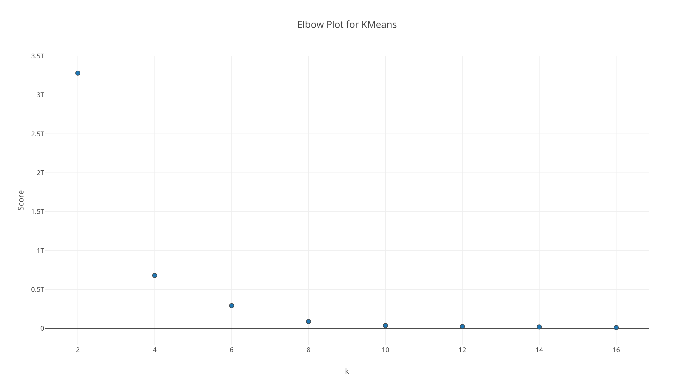

# K-Means Clustering

## Medientransparenz Data

**Data Source**: https://www.medien-transparenz.at

**Objective**: Analyse/Find political relations regarding financial transfers of organisations to various media in Austria.

**Algorihtm**: spark.ml.clustering.KMeans

First the data was filtered for organisations with substring "ministerium" or "kanzleramt" and the selected timeframe (Faymann -> Q1 2014 until Q2 2016, and Kern Q3 2016 until end of data set Q2 2017).

Then the data was extended with political affiliation for each organisation. 
* ÖVP (People's Party) -> 1
* SPÖ (Social Democratic Party) -> 2
* Both -> 3
* Other -> 4

With the setup of the KMeans model it was necessary to determine the best k for the used data set. 
This was achieved with the *computeCost* function:

```scala
def computeCost(data: DataFrame, k: Int): Double = {
  val assembler = new VectorAssembler().setInputCols(data.columns).setOutputCol("features")

  val kMeans = new KMeans()
    .setSeed(Random.nextLong())
    .setK(k)
    .setMaxIter(40)
    .setTol(1.0e-5)
    .setPredictionCol("cluster")
    .setFeaturesCol("features")

  val pipeline = new Pipeline().setStages(Array(assembler, kMeans))

  val kMeansModel = pipeline.fit(data).stages.last.asInstanceOf[KMeansModel]

  kMeansModel.computeCost(assembler.transform(data)) / data.count()
}
```

Using Plotly a graph was generated to find the best K, using the *computeCost* function for a sequence of values:

```scala
val kList = (2 to 16 by 2).map(k => computeCost(numericFrame, k))
```




The "elbow point" was analyzed as k = 4. So a k = 6 was used for computing the KMeans model. 

### Result

| cluster | political orientation | count |
|---------|-----------------------|-------|
| 0       | ÖVP                   | 185   |
| 0       | SPÖ                   | 93    |
| 1       | SPÖ                   | 103   |
| 2       | Other                 | 77    |
| 2       | ÖVP                   | 51    |
| 3       | SPÖ                   | 87    |
| 3       | ÖVP                   | 14    |
| 4       | SPÖ                   | 106   |
| 4       | ÖVP                   | 103   |
| 5       | Both                  | 67    |


Cluster #0, #3 und #4 include both ÖVP and SPÖ ministries. These clusters do not allow any conclusion about a differentiated payment behavior. Clusters # 1 and # 5 each contain a political orientation - Cluster 1 is clearly assigned to the SPÖ, 
which indicates a behavior that is different from the other transfers. A closer examination of this cluster could provide further insight. Cluster # 5 is clearly assigned to the Federal Chancellery, whose payment behavior can be distinguished from that of the ministries. The most interesting is Cluster # 2, which contains the political orientation 9. This classification applies only to the Family and Youth Ministry. Under the government of Faymann II, as well as under Kern, this ministry was headed by Minister Sophie Karmasin, who was nominated by the ÖVP, but is considered as non-party. 
Cluster # 2 also includes payments from one or more ÖVP ministries which suggests that the Ministry of Family Affairs, 
despite it's official non-partyness, has a spending behavior that appears close to or influenced by the ÖVP.
