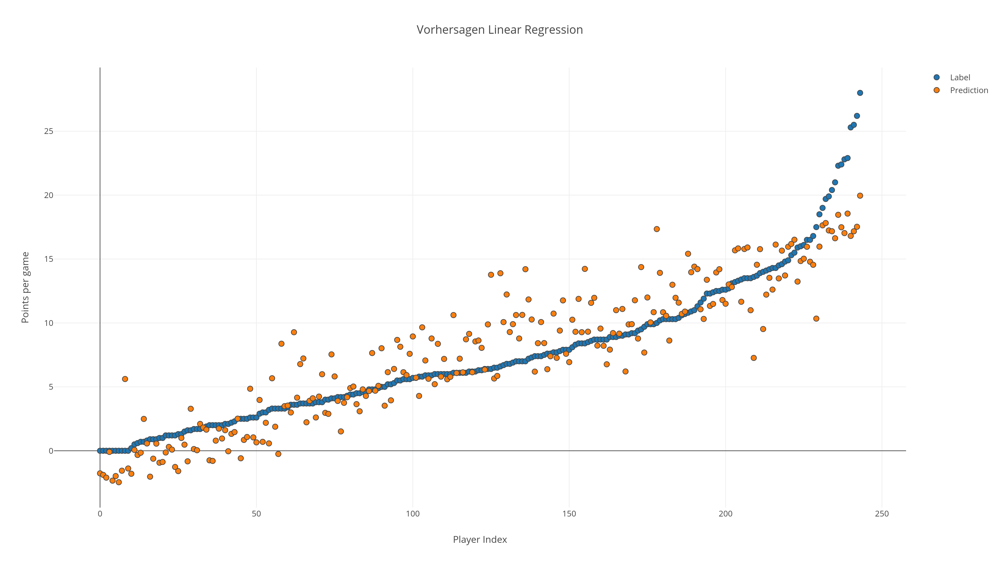

# Linear Regression

## NBA Statistics Data

**Data Source**: API: https://api.mysportsfeeds.co

**Objective**: Predicting points per game for NBA players

**Algorihtm**: spark.ml.regression.LinearRegression

**Label**: Points per game (pointsPG)

**Features**
* Position
* Height
* Weight
* Field goal percentage (fgPct)
* Free throw percentage (ftPct)
* Total games played (gamesPlayed)
* Minutes played per game (minSecPG)

**Training / Test Data Split**: 50/50

**Result metric**: Average Error

### Result
The Mean of the average error for multiple tests was in range (1.9 to 2.1).
